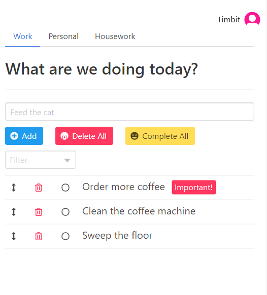

## 1. Improvements to current feature set

#### Reduce Offline Cache
Each offline action is currently cached as a new item in an array. This can be changed so that offline actions are reduced to only their net effects. Making this change would reduce the amount of cache stored in the client browser as well as speed up the upload and processing upon reconnection to the server.

#### Add Cache Handling Server-side
To improve performance of cached actions, the actions could be sent in batches to the server and have the server process each action. At the end of this process, a reload event could be fired and would reduce the number of messages that the client needs to handle.

#### Move Database Out of Memory
The Todo database is currently stored entirely in memory which limits how many entries we can store. By moving the data to a dedicated database and have the server query for the data it needs, it would free up valuable server resources.

#### Add an Identifier to Todos
Currently todos are identified by their title, preventing the same todo from being entered twice.


## 2. User Experience + Interface

#### Add a Reorder Functionality
Using a drag + drop mechanic so that users can organize todos after they have been created.

#### Tabs/Pages
Including multiple tabs/pages with separate todo lists. This would allow users to organize multiple todo lists into categories, days, etc from within the same app.

#### Tags and Filters
Allow users to add tags to todos, like `important`, and then implementing filtering on these tags.

#### Including User Identification
Currently the app serves up one global todo list. If we wanted multiple users, the todo lists should belong to specific users (one or many) and the app would display only the lists belonging to the authorized user.



## 3. Offline Usage and State Resolution
A better solution to offline usage would be to timestamp user actions and reduce them to their net effects. For example:

```
[
  todo_1 completed @ 12:00,
  todo_1 uncompleted @ 12:30,
  todo_1 completed @ 12:31,
]
```

Would be reduced to just `todo_1 completed @ 12:31`. This would reduce the number of actions that the server needs to process on reconnection as well as reduce how much data is being cached client-side. The inclusion of timestamps also helps with state resolution when multiple users have edited the same todo list. In this case, when conflicting actions are sent to the server, we can resolve to the latest change.

## 4. Parent/Child Todos
To add parent/child todos, I would include represent todos more like a graph with parent and child fields holding ids linking to other todos.

#### Server-side
On the server, the todos could be stored as a map of id to the todo.

```
{
  0: {id: 0, title: 'Feed the cat', parent: null, children: [2]},
  1: {id: 1, title: 'Get coffee', parent: null, children: null},
  2: {id: 2, title: 'Clean dish', parent: 0, children: null},
  .
  .
  .
}
```

This would make most of the server-side operations fairly straightforward.

**Insertion:**
Append the new todo to the list. If there are children, locate the children in database and update the parent field to the new todo's id. If there is a parent id, locate the parent and append the todo's id to the children field.

**Deletion:**
Check if there are children, for each child recursively delete each child. If there is a parent, locate the parent and de-reference from the parent's children field. Finally, we can delete the entry.

**Completion:**
Completion remains unchanged. However, the server could check if the todo has children and only allow completion if all children are completed.

#### Client-side
When the data is sent to client side, the todos should be reshaped to a proper graph structure. To do this, we check each todo that has a `parent == null`, these are our top-level todos. Then for each top-level node, we can recursively add each child in the children field.

```
{
  0: {id: 0, title: 'Feed the cat', parent: null, children:{
    2: {id: 2, title: 'Clean dish', parent: 0, children: null}
  }},
  1: {id: 1, title: 'Get coffee', parent: null, children: null}
}
```

**Rendering:** To render this structure to the browser, we use a parent and a child component. If there are children present, we render a parent component and then render each child recursively. This would check each child if they have children and render them as the appropriate component.
